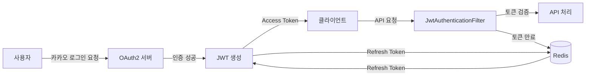

# 🎾 Catch Tennis

> 테니스 매칭 웹 애플리케이션 - "오늘도 함께, 더 가볍게"

테니스 파트너를 찾고, 매칭하고, 실시간 채팅으로 소통하는 모바일 최적화 웹 플랫폼입니다.

<br/>

## 🎯 프로젝트 소개

**Catch Tennis**는 테니스를 즐기는 사람들이 원하는 시간, 장소, 조건에 맞는 상대방을 찾아 매치를 주선하는 플랫폼입니다.

사용자는 카카오 소셜 로그인을 통해 간편하게 가입하고, 원하는 조건의 매치를 등록하거나 참여할 수 있으며, 실시간 채팅을 통해 매치 참가자들과 소통할 수 있습니다.

<br/>

## ✨ 주요 기능

<table>
<tr>
<td width="50%">

### 🔐 1. 인증 및 사용자 관리

- ✅ **카카오 OAuth2 소셜 로그인**
  - 간편한 회원가입 및 로그인
- ✅ **JWT 기반 인증**
  - Access Token + Refresh Token을 활용한 무상태 인증
- ✅ **Redis 세션 관리**
  - Refresh Token을 Redis에 저장하여 빠른 검증 및 관리
- ✅ **프로필 관리**
  - 사용자 정보 수정, 프로필 이미지 업로드 (AWS S3)

</td>
<td width="50%">

### 🎾 2. 매치 관리

- ✅ **매치 생성 및 조회**
  - 경기 타입 (단식, 복식 등), 시간, 장소, 참가비 설정
  - 모집 조건 설정 (나이, 성별, 경력 등)
- ✅ **매치 검색 및 필터링**
  - 지역, 시간, 경기 타입, 성별 등 다양한 조건으로 검색
  - 페이징 처리로 효율적인 데이터 조회
- ✅ **자동 상태 업데이트**
  - Spring Batch를 이용한 스케줄링
  - ShedLock으로 분산 환경에서 중복 실행 방지
  - 매치 시작 시간 지난 경기 자동 완료 처리

</td>
</tr>
<tr>
<td width="50%">

### 💬 3. 실시간 채팅

- ✅ **WebSocket (STOMP)**
  - 실시간 양방향 통신
- ✅ **RabbitMQ Broker Relay**
  - 다중 서버 환경에서 메시지 동기화
  - Auto-scaling 대응 가능한 분산 메시지 브로커
- ✅ **채팅방 관리**
  - 1:1 채팅방 자동 생성
  - 중복 채팅방 방지
  - 채팅 히스토리 조회 (커서 기반 페이징)
- ✅ **JWT 인증 통합**
  - WebSocket 연결 시 JWT 검증

</td>
<td width="50%">

### 📍 4. 코트 관리

- ✅ **테니스 코트 정보 관리**
  - 위치, 좌표 정보 포함
- ✅ **지도 기반 검색**
  - 위도/경도 정보를 활용한 위치 기반 검색 지원

</td>
</tr>
</table>

<br/>

## 🛠 기술 스택

### 🔧 Backend Framework


- **Java 17**: 최신 LTS 버전으로 안정성과 성능 보장
- **Spring Boot 3.5.7**: 엔터프라이즈급 애플리케이션 개발 프레임워크
- **Spring Data JPA**: 엔티티 관리 및 DB 접근 계층 추상화
- **Spring Security**: 인증/인가 처리 및 보안 강화
- **Spring Batch**: 배치 작업 스케줄링 및 대용량 데이터 처리

### 💾 Database & Cache


- **MySQL**: 메인 데이터베이스 (관계형 데이터 저장)
- **Redis**: 세션 관리 및 캐싱 (Refresh Token 저장)

### 🔄 Message Broker & WebSocket


- **RabbitMQ**: 분산 메시지 브로커 (Auto-scaling 대응)
- **STOMP over WebSocket**: 실시간 양방향 통신 프로토콜

### 🔐 Authentication & Security


- **Spring OAuth2 Client**: 카카오 소셜 로그인 통합
- **JWT (jjwt 0.12.3)**: Access/Refresh Token 기반 무상태 인증

### ☁️ Cloud & Storage


- **AWS S3**: 이미지 파일 저장소
- **Presigned URL**: 클라이언트 직접 업로드 방식 (보안 강화)

### 🚀 CI/CD & Deployment


- **AWS CodePipeline**: CI/CD 파이프라인 자동화
- **AWS CodeBuild**: Gradle 빌드 자동화
- **AWS CodeDeploy**: Blue/Green 무중단 배포
- **AWS EC2**: 애플리케이션 서버 호스팅

### 🎯 Etc


- **Lombok**: 보일러플레이트 코드 감소 (Getter, Setter, Builder 등)
- **SpringDoc OpenAPI (Swagger)**: 자동 API 문서화
- **ShedLock**: 분산 환경 스케줄러 중복 실행 방지

<br/>

## 📁 프로젝트 구조

```
src/main/java/com/example/scsa/
│
├── 📦 batch/                          # Spring Batch 설정 및 스케줄러
│   ├── MatchStatusBatchConfig.java   # 매치 상태 업데이트 배치 설정
│   └── MatchStatusScheduler.java     # 배치 작업 스케줄러
│
├── ⚙️ config/                         # 애플리케이션 설정
│   ├── SecurityConfig.java           # Spring Security 설정
│   ├── WebSocketConfig.java          # WebSocket STOMP 설정
│   ├── RedisConfig.java              # Redis 세션 관리 설정
│   ├── S3Config.java                 # AWS S3 클라이언트 설정
│   ├── SwaggerConfig.java            # API 문서화 설정
│   └── filter/
│       ├── JwtAuthenticationFilter.java  # JWT 토큰 검증 필터
│       └── BotBlockingFilter.java         # Bot 차단 필터
│
├── 🌐 controller/                     # REST API 엔드포인트
│   ├── MatchController.java          # 매치 관련 API
│   ├── ChatWsController.java         # WebSocket 채팅 API
│   ├── CourtController.java          # 코트 관련 API
│   └── UserProfileController.java    # 사용자 프로필 API
│
├── 📊 domain/
│   ├── entity/                       # JPA 엔티티
│   │   ├── Match.java                # 매치 엔티티
│   │   ├── MatchGuest.java           # 매치 참가자 엔티티
│   │   ├── Court.java                # 코트 엔티티
│   │   ├── User.java                 # 사용자 엔티티
│   │   ├── Chat.java                 # 채팅 메시지 엔티티
│   │   └── ChatRoom.java             # 채팅방 엔티티
│   └── vo/                           # Value Objects (Enum)
│       ├── MatchStatus.java          # 매치 상태 (모집중, 완료 등)
│       ├── GameType.java             # 경기 타입 (단식, 복식 등)
│       ├── Gender.java               # 성별
│       └── Period.java               # 기간 (나이대 등)
│
├── 📤 dto/                            # 데이터 전송 객체
│   ├── auth/                         # 인증 관련 DTO
│   ├── match/                        # 매치 관련 DTO
│   ├── chat/                         # 채팅 관련 DTO
│   └── court/                        # 코트 관련 DTO
│
├── ⚠️ exception/                      # 커스텀 예외 및 핸들러
│   ├── GlobalExceptionHandler.java   # 전역 예외 처리기
│   └── ErrorCode.java                # 에러 코드 정의
│
├── 🎯 handler/                        # OAuth2 핸들러
│   └── auth/                         # 인증 성공/실패 핸들러
│
├── 💾 repository/                     # JPA Repository
│   ├── MatchRepository.java          # 매치 데이터 접근
│   ├── UserRepository.java           # 사용자 데이터 접근
│   ├── ChatRepository.java           # 채팅 데이터 접근
│   └── CourtRepository.java          # 코트 데이터 접근
│
├── 🔧 service/                        # 비즈니스 로직
│   ├── match/                        # 매치 비즈니스 로직
│   ├── chat/                         # 채팅 비즈니스 로직
│   ├── court/                        # 코트 비즈니스 로직
│   └── auth/                         # 인증 비즈니스 로직
│
└── 🛠 util/                           # 유틸리티 클래스
    ├── JwtUtil.java                  # JWT 토큰 생성/검증
    └── CookieUtils.java              # 쿠키 관리
```

<br/>

## 🏗 핵심 아키텍처 설계

### 🔐 1. 인증 플로우



**플로우 상세**
1. 사용자 → 카카오 로그인 요청
2. OAuth2 인증 성공 → JWT 생성 (Access + Refresh Token)
3. Refresh Token → Redis 저장 (TTL 설정)
4. 모든 API 요청 시 JwtAuthenticationFilter에서 Access Token 검증
5. Access Token 만료 시 Refresh Token으로 재발급

---

### 💬 2. 실시간 채팅 아키텍처

```
┌─────────────────┐                           ┌─────────────────┐
│  클라이언트 A   │                           │  클라이언트 B   │
│                 │                           │                 │
│  WebSocket      │                           │  WebSocket      │
│  Connect        │                           │  Connect        │
└────────┬────────┘                           └────────┬────────┘
         │                                             │
         │            ┌───────────────────┐            │
         └────────────┤  Load Balancer    │────────────┘
                      └─────────┬─────────┘
                                │
              ┌─────────────────┼─────────────────┐
              │                 │                 │
        ┌─────▼─────┐     ┌─────▼─────┐     ┌─────▼─────┐
        │ Server 1  │     │ Server 2  │     │ Server 3  │
        │  (STOMP)  │     │  (STOMP)  │     │  (STOMP)  │
        └─────┬─────┘     └─────┬─────┘     └─────┬─────┘
              │                 │                 │
              └─────────────────┼─────────────────┘
                                │
                      ┌─────────▼─────────┐
                      │   RabbitMQ Broker │
                      │  (Message Queue)  │
                      └───────────────────┘
                                │
                    메시지 브로드캐스트 & 동기화
```

**특징**
- 다중 서버 환경에서 RabbitMQ를 통한 메시지 동기화
- Auto-scaling 대응 가능한 분산 아키텍처
- STOMP 프로토콜 기반 실시간 양방향 통신

---

### ⏰ 3. 배치 스케줄링

```
┌──────────────────────────────────────────────────┐
│           Spring Batch Scheduler                 │
│                                                   │
│  ┌─────────────────────────────────────────┐    │
│  │  @Scheduled(cron = "0 0 0 * * *")       │    │
│  │  매일 자정 실행                          │    │
│  └──────────────┬──────────────────────────┘    │
│                 │                                │
│                 ▼                                │
│  ┌─────────────────────────────────────────┐    │
│  │  ShedLock (분산 잠금)                    │    │
│  │  - 다중 서버 중 1개만 실행 보장          │    │
│  │  - DB 기반 분산 락 메커니즘              │    │
│  └──────────────┬──────────────────────────┘    │
│                 │                                │
│                 ▼                                │
│  ┌─────────────────────────────────────────┐    │
│  │  MatchStatusBatchConfig                  │    │
│  │  - 만료된 매치 상태 업데이트             │    │
│  │  - RECRUITING → COMPLETED                │    │
│  └─────────────────────────────────────────┘    │
└──────────────────────────────────────────────────┘
```

**기능**
- **ShedLock**: 다중 서버 환경에서 1개 인스턴스만 배치 실행 보장
- **Spring Batch**: 만료된 매치 자동 완료 처리 (매일 자정 실행)

---

### 🚀 4. CI/CD 파이프라인

```
┌──────────────┐
│ GitHub Push  │
└──────┬───────┘
       │
       ▼
┌──────────────────────┐
│ AWS CodePipeline     │
│ (자동 트리거)         │
└──────┬───────────────┘
       │
       ▼
┌──────────────────────┐
│ AWS CodeBuild        │
│ - Gradle Build       │
│ - Unit Test          │
│ - JAR 생성           │
└──────┬───────────────┘
       │
       ▼
┌──────────────────────┐
│ S3 아티팩트 업로드    │
│ - Build 산출물 저장   │
└──────┬───────────────┘
       │
       ▼
┌──────────────────────┐
│ AWS CodeDeploy       │
│ - Blue/Green 배포    │
│ - 무중단 배포         │
└──────┬───────────────┘
       │
       ▼
┌──────────────────────┐
│ EC2 인스턴스         │
│ - Health Check       │
│ - 애플리케이션 시작   │
└──────────────────────┘
```

**배포 전략**
- Blue/Green 배포로 무중단 서비스 보장
- Health Check 통과 시에만 트래픽 전환
- 롤백 지원 (배포 실패 시 이전 버전으로 자동 복구)

<br/>

## 📖 API 문서

애플리케이션 실행 후 Swagger UI를 통해 모든 API 명세를 확인할 수 있습니다.

```
🔗 http://localhost:8080/swagger-ui.html
```

<br/>

### 📌 주요 엔드포인트

<table>
<tr>
<td width="50%">

#### 🎾 매치 API

| Method | Endpoint | 설명 | 인증 |
|--------|----------|------|------|
| `GET` | `/api/v1/matches` | 매치 리스트 조회 (필터링, 페이징) | ❌ |
| `GET` | `/api/v1/matches/{match_id}` | 매치 상세 조회 | ❌ |
| `POST` | `/api/v1/my/matches` | 매치 생성 | ✅ |
| `PATCH` | `/api/v1/my/matches/{match_id}` | 매치 상태 변경 | ✅ |
| `DELETE` | `/api/v1/my/matches/{match_id}` | 매치 삭제 | ✅ |

</td>
<td width="50%">

#### 👤 사용자 API

| Method | Endpoint | 설명 | 인증 |
|--------|----------|------|------|
| `GET` | `/api/v1/auth/status` | 로그인 상태 확인 | ✅ |
| `GET` | `/api/v1/users/{userId}` | 프로필 조회 | ❌ |
| `PUT` | `/api/v1/profile` | 프로필 수정 | ✅ |
| `GET` | `/api/v1/presigned-url` | S3 Presigned URL 발급 | ✅ |

</td>
</tr>
<tr>
<td colspan="2">

#### 💬 채팅 API (WebSocket)

| Type | Endpoint | 설명 |
|------|----------|------|
| `CONNECT` | `/ws-stomp` | WebSocket 연결 (JWT 헤더 필요) |
| `SEND` | `/app/chat.send` | 채팅 메시지 전송 |
| `SUBSCRIBE` | `/topic/chatroom.{chatRoomId}` | 채팅방 구독 (실시간 메시지 수신) |

**WebSocket 연결 예시**
```javascript
const socket = new SockJS('http://localhost:8080/ws-stomp');
const stompClient = Stomp.over(socket);

stompClient.connect(
  { Authorization: `Bearer ${accessToken}` },
  (frame) => {
    stompClient.subscribe('/topic/chatroom.123', (message) => {
      console.log('메시지 수신:', JSON.parse(message.body));
    });
  }
);
```

</td>
</tr>
</table>

<br/>

## ⚙️ 환경 변수 설정

`.env.local` 또는 `.env.prod` 파일을 생성하여 다음 환경 변수를 설정합니다.

### 📊 Database

```bash
# MySQL 데이터베이스 연결 설정
SPRING_DATASOURCE_URL=jdbc:mysql://localhost:3306/tennis_db
SPRING_DATASOURCE_USERNAME=your_username
SPRING_DATASOURCE_PASSWORD=your_password
```

### 💾 Redis

```bash
# Redis 세션 관리 설정
SPRING_REDIS_HOST=localhost
SPRING_REDIS_PORT=6379
```

### 🔄 RabbitMQ

```bash
# RabbitMQ 메시지 브로커 설정
SPRING_RABBITMQ_HOST=localhost
SPRING_RABBITMQ_PORT=5672
SPRING_RABBITMQ_STOMP_PORT=61613
SPRING_RABBITMQ_USERNAME=guest
SPRING_RABBITMQ_PASSWORD=guest
SPRING_RABBITMQ_VIRTUAL_HOST=/
```

### 🔐 JWT

```bash
# JWT 토큰 설정
JWT_SECRET=your_jwt_secret_key_here
JWT_ACCESS_TOKEN_EXPIRATION=3600000      # 1시간 (밀리초)
JWT_REFRESH_TOKEN_EXPIRATION=604800000   # 7일 (밀리초)
```

### 🔑 OAuth2 (Kakao)

```bash
# 카카오 소셜 로그인 설정
SPRING_SECURITY_OAUTH2_CLIENT_REGISTRATION_KAKAO_CLIENT_ID=your_kakao_client_id
SPRING_SECURITY_OAUTH2_CLIENT_REGISTRATION_KAKAO_CLIENT_SECRET=your_kakao_client_secret
SPRING_SECURITY_OAUTH2_CLIENT_REGISTRATION_KAKAO_REDIRECT_URI=http://localhost:8080/login/oauth2/code/kakao
```

### ☁️ AWS S3

```bash
# AWS S3 이미지 저장소 설정
AWS_S3_BUCKET_NAME=your_bucket_name
AWS_S3_REGION=ap-northeast-2
AWS_ACCESS_KEY_ID=your_access_key
AWS_SECRET_ACCESS_KEY=your_secret_key
```

### 🌐 CORS

```bash
# CORS 허용 도메인 설정
CORS_ALLOWED_ORIGINS=http://localhost:3000
```

<br/>

## 🚀 로컬 실행 방법

### 📋 사전 요구사항

| 항목 | 버전 | 필수 여부 |
|------|------|-----------|
| **Java** | 17 이상 | ✅ |
| **MySQL** | 8.0 이상 | ✅ |
| **Redis** | 7.0 이상 | ✅ |
| **RabbitMQ** | 3.12 이상 (STOMP 플러그인 필요) | ✅ |

<br/>

### 1️⃣ 데이터베이스 설정

```sql
-- MySQL 데이터베이스 생성
CREATE DATABASE tennis_db CHARACTER SET utf8mb4 COLLATE utf8mb4_unicode_ci;
```

### 2️⃣ RabbitMQ STOMP 플러그인 활성화

```bash
# STOMP 플러그인 활성화
rabbitmq-plugins enable rabbitmq_stomp
rabbitmq-plugins enable rabbitmq_web_stomp

# RabbitMQ 서비스 재시작 (필요 시)
# macOS (Homebrew)
brew services restart rabbitmq

# Linux (systemd)
sudo systemctl restart rabbitmq-server
```

### 3️⃣ 애플리케이션 실행

```bash
# 1. 의존성 설치 및 빌드
./gradlew clean build

# 2. 애플리케이션 실행 (로컬 환경)
./gradlew bootRun

# 또는 JAR 파일 직접 실행
java -jar build/libs/scsa-0.0.1-SNAPSHOT.jar
```

### ✅ 실행 확인

서버는 기본적으로 `http://localhost:8080`에서 실행됩니다.

| 확인 항목 | URL |
|----------|-----|
| 헬스 체크 | `http://localhost:8080/actuator/health` |
| Swagger UI | `http://localhost:8080/swagger-ui.html` |
| API 문서 | `http://localhost:8080/v3/api-docs` |

<br/>

## 📦 배포

AWS EC2 환경에서의 자동 배포를 지원합니다.

### 🔧 배포 스크립트

| 스크립트 | 역할 | 위치 |
|---------|------|------|
| `setup-env.sh` | 환경 변수 설정 | `scripts/setup-env.sh` |
| `start.sh` | 애플리케이션 시작 (Blue/Green) | `scripts/start.sh` |
| `stop.sh` | 기존 애플리케이션 중지 | `scripts/stop.sh` |
| `health-check.sh` | 헬스 체크 검증 | `scripts/health-check.sh` |

### 📋 배포 프로세스

```
1️⃣ GitHub에 코드 푸시
        ↓
2️⃣ CodePipeline 자동 트리거
        ↓
3️⃣ CodeBuild에서 Gradle 빌드 실행
        ↓
4️⃣ 빌드 산출물 S3 업로드
        ↓
5️⃣ CodeDeploy가 EC2에 자동 배포
        ↓
6️⃣ 헬스 체크 통과 시 배포 완료 ✅
```

<br/>

## 👥 팀 구성
| 역할 | 이름 |
|------|------|
| 🎨 **Frontend** | 김동훈 프로 |
| ⚙️ **Backend** | 나정원, 박예영 프로 |
| 🚀 **DevOps** | 심현우 프로 |
| 🔍 **QA/QC** | 이미르 프로 

## 📝 라이센스

This project is licensed under the MIT License.

## 📞 문의

프로젝트에 대한 문의사항이 있으시면 [GitHub Issues](https://github.com/Samsung-SCSA-25th-Team2/tennis-web-app-fe/issues)를 통해 연락 주세요.

---

<div align="center">

**Catch Tennis** - 테니스를 사랑하는 모든 이들을 위한 매칭 플랫폼

</div>
